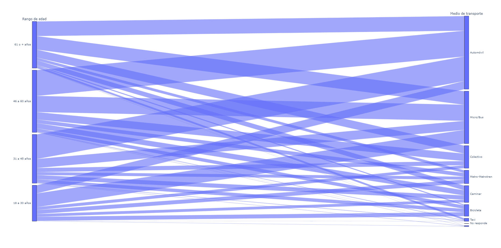

# Portafolio Diego Isaac Riquelme Ramírez (EN PROGRESO)

#### Contacto: 
- rrdiegoisaac@gmail.com
- https://www.linkedin.com/in/rrdiegoisaac/

#### Habilidades Técnicas: Python, SQL, R, Power BI, Tableau, AWS, API

## Educación
- Ingeniería Comercial (2018-2023)						       		
- Tesis: LIBRE COMERCIO Y PROTECCIONISMO: TRAYECTORIA COMERCIAL Y RECUPERACIÓN ECONÓMICA EN EL CONTEXTO DEL COVID-19, EN CHILE Y ARGENTINA	        		
- Conocimientos en econometría, data science, big data, marketing, economía, finanzas y administración

## Experiencia
   **Consumir API para automatización**
· Utilizando la API de "Mercado público", implementé una solución que permitió la extracción
diaria de información relevante y su posterior organización en un formato Excel personalizado, lo
que contribuyó a mantener un orden y a mejorar la concisión en el manejo de datos.

   **Desarrollo de página web corporativa**
· Elaboré y diseñé una página web corporativa, en la que se incluye toda la información relevante
para la empresa, como sus servicios, costos y contacto.

   **Análisis de impacto medioambiental mediante Power BI**
· Obtuve y trabajé una base de datos del ministerio del Medio Ambiente en Chile, con la cual generé
análisis detallados sobre los comportamientos de distintos géneros, ubicaciones geográficas y de
rangos etarios, para conocer patrones y preocupaciones de la población respecto al cambio
climático.

   **Análisis encuesta mediante Python**
· Realicé limpieza, análisis estadístico y visual a una encuesta, en la cual posteriormente apliqué
Análisis Clúster y Análisis de Componentes Principales, con estos identifiqué patrones
significativos y tendencias ocultas en los datos.

## Proyectos
### Análisis de encuesta ambiental

- Descripción:
Desarrollé un análisis de una encuesta realizada por el Ministerio del Medio Ambiente de Chile.

- Análisis:

Los sentimientos generales de los ciudadanos de Chile son de desesperanza, pena y miedo.

Se realizó un análisis detallado de comportamiento de las personas, según su rango etario.
