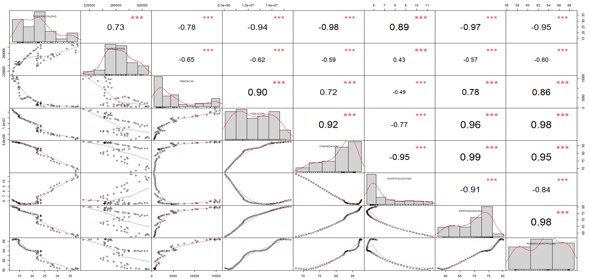
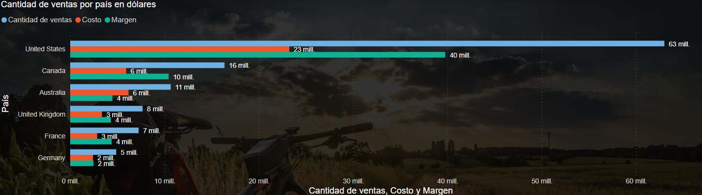

# Portafolio Diego Isaac Riquelme Ramírez (EN PROGRESO)

## Índice

1. [Contacto](#contacto)
2. [Habilidades Técnicas](#habilidades-técnicas)
3. [Educación](#educación)
4. [Experiencia](#experiencia)
5. [Proyectos](#proyectos)
    - [Ejemplos de visualizaciones](#ejemplos-de-visualizaciones)
    - [Informe de ventas](#informe-de-ventas)
    - [Análisis de encuesta ambiental](#análisis-de-encuesta-ambiental)
    

---

## Contacto
- rrdiegoisaac@gmail.com
- [LinkedIn](https://www.linkedin.com/in/rrdiegoisaac/)

## Habilidades Técnicas y Conocimientos
- Python
- SQL
- R
- Power BI
- Tableau
- Microsoft Office Suite
- AWS
- API

## Educación
- Ingeniería Comercial (2018-2023) Universidad Tecnológica Metropolitana
- Tesis: LIBRE COMERCIO Y PROTECCIONISMO: TRAYECTORIA COMERCIAL Y RECUPERACIÓN ECONÓMICA EN EL CONTEXTO DEL COVID-19, EN CHILE Y ARGENTINA
- Conocimientos en econometría, data science, big data, marketing, economía, finanzas y administración

## Experiencia

### Consumir API para automatización
- Utilizando la API de "Mercado público", implementé una solución que permitió la extracción diaria de información relevante y su posterior organización en un formato Excel personalizado, lo que contribuyó a mantener un orden y a mejorar la concisión en el manejo de datos.

### Desarrollo de página web corporativa
- Elaboré y diseñé una página web corporativa, en la que se incluye toda la información relevante para la empresa, como sus servicios, costos y contacto.

### Análisis de impacto medioambiental mediante Power BI
- Obtuve y trabajé una base de datos del ministerio del Medio Ambiente en Chile, con la cual generé análisis detallados sobre los comportamientos de distintos géneros, ubicaciones geográficas y de rangos etarios, para conocer patrones y preocupaciones de la población respecto al cambio climático.

### Análisis encuesta mediante Python
- Realicé limpieza, análisis estadístico y visual a una encuesta, en la cual posteriormente apliqué Análisis Clúster y Análisis de Componentes Principales, con estos identifiqué patrones significativos y tendencias ocultas en los datos.

## Ejemplos de visualizaciones

https://github.com/rrdiegoisaac/Portafolio/assets/164385592/15d9d7ae-1013-4809-ae58-f7f2d052ef46

https://github.com/rrdiegoisaac/Portafolio/assets/164385592/b7f7ce9b-079d-4dbd-8a23-3e4d5b11b5a9

https://github.com/rrdiegoisaac/Portafolio/assets/164385592/f7530c76-742e-4d81-a2c2-2faa9c13bb58

## Proyectos

### Informe de ventas
- Descripción:
En este proyecto, he explorado la base de datos de Adventure Works, una simulación de base de datos de ventas y operaciones comerciales, utilizando herramientas de visualización de datos. A través de la creación de diversos gráficos y visualizaciones, he desglosado patrones, tendencias y relaciones clave.

---

### Análisis de encuesta ambiental
- Descripción:
Desarrollé un análisis de una encuesta realizada por el Ministerio del Medio Ambiente de Chile para conocer tendencias, preocupaciones y percepciones de la población respecto al medio ambiente.

- Análisis:
Sentimientos generales de la población ante el cambio climático:

---

